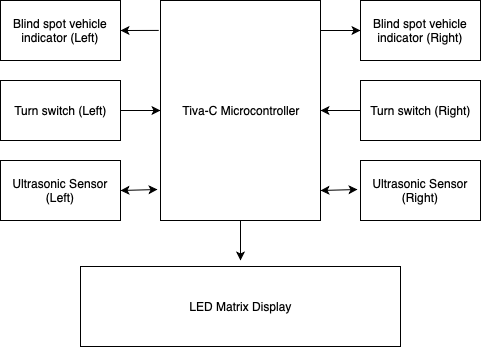

# Rearview radar for bicycles:
This project is designed to improve safety in bicycles. It uses ultrasonic sensors to detect vehicles 
approachig the bike from blind spots and warns the rider by using a light indication system. In addition,
it also acts as a lighting system providing turn and stop lights for the bike.

### Contents:
* [Design and Implementation](#design-and-implementation)
* [Design Requirements](#design-requirements)
* [Ultrasonic Sensor Library](#ultrasonic-sensor-library)
* [Signaling System Library](#signaling-system-library)
* [LED Matrix Library](#led-matrix-library)
* [Application code](#application-code)
* [Block Diagram](#block-diagram)
* [Images](#images)

## Design and Implementation:
This design’s hardware is based around the TM4C123GH6PM ARM based microcontroller in the form of a Tiva Launchpad
which has two integrated momentary push buttons which are utilized for the left and right turn signals, and three LEDs
of which we have used the blue and green to indicate the left and right blind spot warning signals (respectively). 
The system also includes a JSN-SR04T-2.0 ultrasonic waterproof sensor, a four panel LED matrix display which uses the 
MAX7219 as the display driver for each individual panel, and one limit switch to be used for the brake sensor.
The software implementation is comprised of several modules, the main application file, a library for the ultrasonic
sensor, a library for the signaling system (turn and brake signals), and a library for the LED matrix. Many of these
libraries utilize the timer and SSI peripherals on the microcontroller, as well as interrupts with specific priority
requirements on almost every port.

## Design Requirements:
In this design we must account for the real time requirements that it must respond to user input on the turn and brake
signals appropriately, and must be able to poll the ultrasonic sensors (USS) frequently enough that the user will know if
there is a vehicle close enough to create a hazard. The USS work by sending out a small pulse to initiate a reading, then
counting the time it takes to get a response in order to calculate the distance of the object. For this reason this function 
had the highest priority of our design as a small number of clock cycles could cause the distance calculations to be 
inaccurate. The brake signal was our next priority so the system will respond promptly if the user presses or releases 
the brake. Next is the button to enable the turn signals to flash. After that we have prioritized the periodic checking 
of the USS. Finally the flashing of the turn signals.

## Ultrasonic Sensor library:
The USS library we created works by initializing a timer to periodically check the blind spots every 200ms. The system 
accomplishes this by sending out a small >10us pulse to the trigger pin of the sensor. The sensor will then send out an
ultrasonic pulse and wait for the sound to bounce back from an object. During this waiting period, it will set the echo pin
on the sensor high, then bring it low again after receiving a response (or after a 38ms timeout period). The software has 
an interrupt routine listening for either a rising or falling edge on the echo pin which will enable a timer on the 
rising edge, and disable the timer on the falling edge. By measuring how many microseconds the timer was enabled, we are 
able to divide that number by 58 [1] to calculate the number of centimeters an object is a way. After calculating this 
distance for both the left and the right USS, the software will compare it to a pre-set distance threshold value
(40cm for our testing purposes). If the measured distance is below this threshold, there is an object present and it
will turn on the blue LED for the left sensor, or the green LED for the right sensor. If the measured distance is 
above this threshold it will turn off the respective LED.

## Signaling System Library:
The signaling system library begins by initializing interrupts for the left and the right turn signal switches which 
are the on board momentary push buttons for our Tiva Launchpad, an interrupt on the brake limit switch, and a timer 
module with a 500ms interval to flash the turn signals. The turn button ISR will trigger on a falling edge and checks
to see if the left, right, or both turn signals (hazards) have been pressed, which will then call the software to 
toggle the respective signal. The system will turn on the determined signal if it is not currently running, 
immediately overriding any other turn / hazard signal that is currently being displayed, then enable the flashing 
timer. To enable or disable a signal, the software passes an array variable to the LED matrix library with the 
request to either turn off or turn on specific LEDs on the display. If the determined signal is already running 
then it will disable the display and the flashing timer. When the brake signal ISR is triggered, it will determine 
if it is a falling edge in which case it will turn on the brake signal, or on a rising edge it will turn off the 
brake signal.

## LED Matrix Library: 
The LED matrix library must first initialize the LED panel display by disabling the shutdown mode register, disabling 
the display test register, setting the decode mode to no-decode, setting the scan limit, and setting the intensity [2].
It will then blank out the display to give us a predictable starting point for when we change the display in the future.
The library changes these registers by manually pulling the slave select line low, then sending the register’s address
followed by the desired setting over SPI at a rate of 10Mhz. It will repeat this four times (because our system has
4 panels, but could easily be expanded to a different number) before setting the slave select line high again. 
When we are ready to change the display to show a turn signal or a brake signal, the software will compare the
requested display to what is currently on the screen to determine what values need to be changed, then will begin
by pulling the slave select low, then addressing the digit 0 register on the 1st panel, then the digit 0 of the 
2nd panel, followed by third and fourth. Once all the panels have been sent their data the slave select will be 
set high and the internal chips on the display will update the display. This procedure is then repeated for the 
digit 1 - 7 registers.

## Application code:
The main application file is very simple when implemented with the other library files. It begins by setting the 
clock speed of the microcontroller, then setting up the sleep and power management configuration. Then it will call 
the setupButtons and setupLights functions of the signal system library. Then it will initialize the blind spot LEDs,
setup USS sensor 1, USS sensor 2, then the timer that will periodically poll the sensors. Finally it will configure the 
interrupt priorities in accordance to our plan as mentioned in paragraph three of this subsection. The main application
will then enter a permanent while loop where if no other interrupts stop the system, it will put the processor to sleep 
to conserve power.

## Block Diagram:

  

## Images:

  
  
